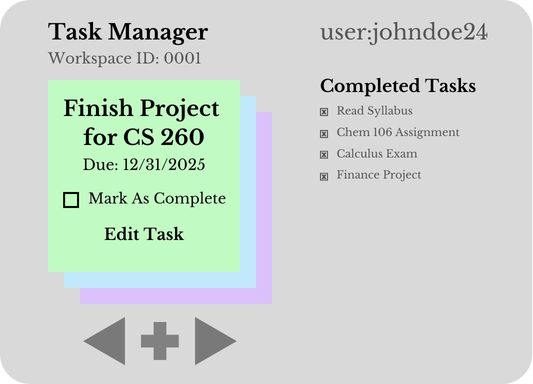

# startup
startup application for BYU CS 260

[Notes for CS 260](notes.md)

## Startup Specification

### Elevator Pitch

Have you ever been frustrated with a group project? Have you ever been overwhelmed with your class schedule? Do you have a seemingly endless list of things that you need to do? This task manager application allows you to keep track of that list of 'to-dos.' Organize your own personal responsibilities or work as a team in a shared workspace.

### Concept Art

### Key Features

- Secure login
- Able to add, edit and delete tasks
- Real-time updating in shared boards
- Tasks are stored under user profiles
- Ability to see previously completed tasks

### Technologies

This is how each technology will be used: 

- **HTML** - Using HTML to create correct pages for the application. A login page will be created and a page for organizing tasks.
- **CSS** - Uses this to create an appealing UI which correctly and simply organizes tasks.
- **JavaScript** - Allows login, adding, editing, completing, and deleting tasks. 
- **Service**  - Service endpoints of login, editing tasks, and completing tasks.
- **DB/Login** - Store users, boards and tasks. 
- **WebSocket** - As changes are made in certain boards, those boards are updated for other users.
- **React** - Port application to use the React web framework.

## HTML Deliverable

**HTML pages** - Four HTML pages that corrospond with login, personal tasks, shared tasks, and more information.  
**Links** - Links to each page are accessable to freely navigate.  
**Text** - Text is found on each button option and Placeholder text on tasks.  
**Images** - Flavicon Icon added.  
**DB/Login** - Placeholder for login, Placeholder on tasks from where it would pull from the database.  
**3rd Party Call** - Date task was created will be pulled from a 3rd party API.  
**WebSocket** - The shared tasks will be updated as others make changes to tasks.  

## CSS Deliverable

[x] - done - Prerequisite: Simon CSS deployed to your production environment
[x] - done - Prerequisite: A link to your GitHub startup repository prominently displayed on your application's home page
[x] - done - Prerequisite: Notes in your startup Git repository README.md file
[x] - done - 30% Header, footer, and main content body. Used flex to layout sections.
[x] - done - 20% Navigation elements. Buttons highlight when hovered over.
[x] - done - 10% Responsive to window resizing. Looks great on iPad, desktop, and iPhone.
[x] - done - 20% Application elements. Buttons are using bootstrap
[x] - done - 10% Application text content. Text is displayed.
[x] - done - 10% Application images.

## JavaScript deliverable

For this deliverable I implemented by JavaScript so that the application works for a single user. I also added placeholders for future technology.

- **login** - When you press enter or the login button it takes you to the manager page.
- **database** - Displayed the task information. Currently this is stored and retrieved from local storage, but it will be replaced with the database data later.
- **WebSocket** - I have a location where shared tasks will be stored and viewed. This will be later replaced with Websocked Data.
- **application logic** - Editing, deleting, creating and marking tasks as complete all have been implemented. Users also can go through tasks.